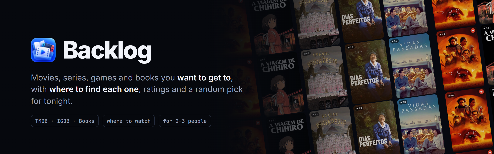
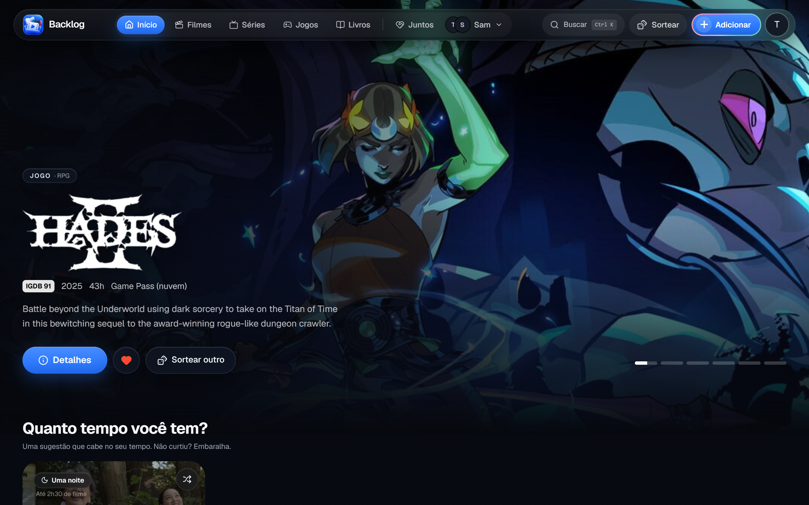
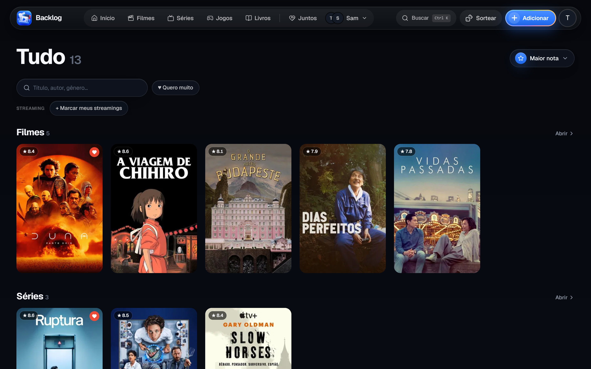
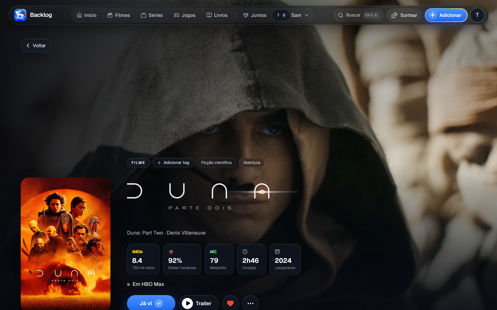
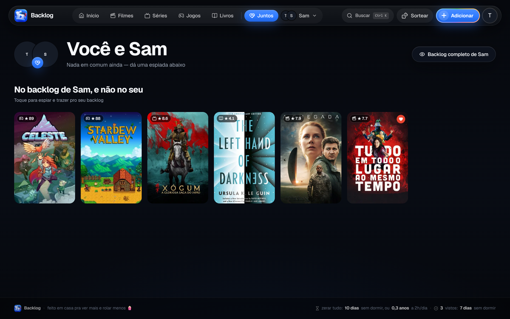
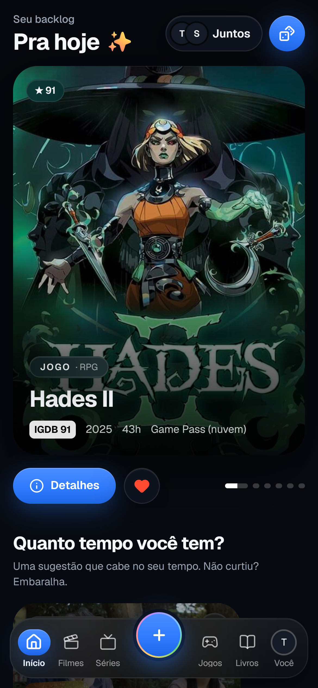

<div align="center">

<picture>
  <source media="(prefers-color-scheme: dark)" srcset=".github/assets/banner-dark.png">
  <source media="(prefers-color-scheme: light)" srcset=".github/assets/banner-light.png">
  
</picture>

<br>


<br><br>

**A PWA for 2–3 people to keep the movies, series, games and books they want to get to,**<br>
**with where to find each one in Brazil. Once you've seen it, it leaves the list.**

[Screenshots](#screenshots) · [Data sources](#data-sources) · [Getting started](#getting-started)

</div>

## Screenshots



<table>
  <tr>
    <td width="50%"></td>
    <td width="50%"></td>
  </tr>
  <tr>
    <td align="center"><b>Backlog</b> · sorted by score, filtered by your streaming services</td>
    <td align="center"><b>Details</b> · every rating, where to watch, trailer</td>
  </tr>
  <tr>
    <td width="50%"></td>
    <td width="50%" align="center"></td>
  </tr>
  <tr>
    <td align="center"><b>Together</b> · what you both want, and what to borrow from the other list</td>
    <td align="center"><b>On a phone</b></td>
  </tr>
</table>

<sub>A sample backlog for two made-up people, on a throwaway database. The interface is in Brazilian Portuguese.</sub>

## Features

|                                 |                                                                                                       |
| ------------------------------- | ----------------------------------------------------------------------------------------------------- |
| 🎬 **Four kinds, one list**     | Movies, series, games and books, each enriched with cover, cast or authors, genres and length.       |
| 📍 **Where to find it**         | Streaming services in Brazil (via JustWatch), Game Pass, Steam price in BRL, Amazon/Kindle links.      |
| ⭐ **One score to sort by**      | IMDb, Rotten Tomatoes, Metacritic, IGDB and Hardcover normalized to 0–10.                             |
| 🎲 **Pick for tonight**         | "How much time do you have?" suggests something that fits, favoring what you really want.             |
| 💞 **Together**                 | See what you both want, and peek at the other person's list to borrow from it.                        |
| 🔔 **Daily refresh**            | A cron job refreshes availability and prices, with push notifications.                               |

## Data sources

| Kind           | Data         | Rating                           | Where                                       |
| -------------- | ------------ | -------------------------------- | ------------------------------------------- |
| Movies/series  | TMDB         | OMDb (IMDb, RT, Metacritic)      | TMDB watch/providers `BR` (JustWatch)       |
| Games          | IGDB         | IGDB                             | Steam (BRL price), Game Pass cloud          |
| Books          | Google Books | Hardcover                        | Amazon/Kindle/Skoob links                   |

## Getting started

```bash
cp .env.example .env.local   # database, Neon Auth and the API keys
npm install
npm run db:migrate
npm run dev
```

- **Database and sign-in:** a [Neon](https://neon.tech) project with Neon Auth and Google
  sign-in. Only the e-mails in `ALLOWED_EMAILS` get in, and each person has their own
  backlog.
- **API keys:** TMDB, OMDb, IGDB (a Twitch app), Google Books and Hardcover. All have free
  tiers.
- **Deploy:** Vercel; `vercel.json` schedules the daily refresh (`/api/cron/refresh`).

<details>
<summary><b>Scripts</b></summary>

<br>

```bash
npm run db:generate && npm run db:migrate   # after changing lib/db/schema.ts
npm run import:obsidian                     # imports a backlog kept in Obsidian notes (idempotent)
npm run import:obsidian -- --recheck        # retries matching for items under review
npx tsx --env-file=.env.local scripts/rescore.ts
```

</details>

## Stack

| Layer    | Technology                                                |
| -------- | --------------------------------------------------------- |
| App      | Next.js 16 (App Router), React 19, Tailwind 4             |
| Data     | Neon Postgres + Drizzle                                   |
| Auth     | Neon Auth (Google), allow-list of e-mails                 |
| Hosting  | Vercel, with a daily cron                                 |

<br>

<div align="center">
<sub>Built by <a href="https://github.com/megomes">Matheus Ervilha</a> to watch more and scroll less.</sub>
</div>
